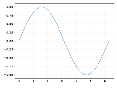
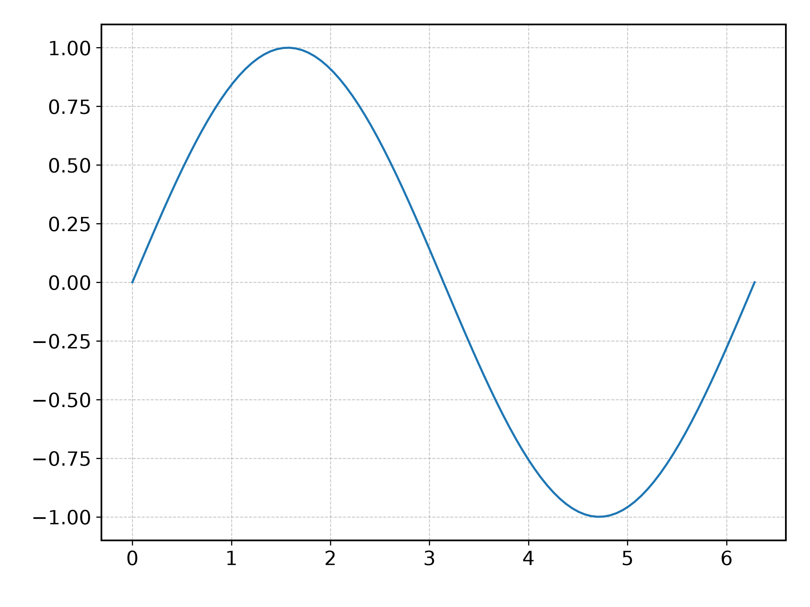

# Formati grafici {#sec-graphics}

Prima o poi (e, più probabilmente, prima che poi) vi troverete a *salvare* su file
un grafico che avete fatto con matplotlib---per inserirlo in una relazione, in un
articolo scientifico, in una pagina web, o per inviarlo alla vostra compagna di gruppo.
La funzione
[savefig()](https://matplotlib.org/stable/api/_as_gen/matplotlib.pyplot.savefig.html)
di matplotlib vi permette di farlo in una miriade di formati diversi

```{python}
from matplotlib import pyplot as plt

plt.gcf().canvas.get_supported_filetypes()
```
La domanda ovvia è: qual è quello giusto?

::: {.callout-note}
Tecnicamente il ventaglio dei formati grafici che avete a disposizione dipende
dal *backend* di matplotlib che utilizzate, ma dato che i formati più popolari sono
supportati da tutti i backend, lo consideriamo un dettaglio tecnico.
:::


## Formati raster e formati vettoriali

La prima distinzione fondamentale che è utile fare è tra i formati di tipo raster
(come png e jpg) e quelli vettoriali (come pdf e svg).

Un'immagine *raster*, o *bitmap* è essenzialmente una matrice rettangolare di quadratini
(o *pixel*) ciascuno dei quali è definito da un colore. Se pensate a come funziona la
macchina fotografica del vostro smartphone, la cosa ha perfettamente senso: l'immagine
è acquisita attraverso un sensore pixelizzato in cui ciascun pixel opera indipendentemente
per cui salvare un'immagine in formato raster è più che naturale.
(La cosa è leggermente più complicata di così, perché nella maggior parte dei casi le
immagini sono compresse per salvare spazio, ma questo è un dettaglio che va oltre i
nostri scopi.)

Un formato vettoriale, al contrario, implementa una descrizione del contenuto dell'immagine
in termini di *primitive geometriche*---punti, linee, cerchi, lettere---ciascuna con
determinate caratteristiche (posizione, dimensioni, colore). Ora, se pensate un attimo,
è abbastanza chiaro che la maggior parte delle cose che interessa a noi come Fisiche
(e.g., grafici, diagrammi, costruzioni geometriche) si presta più o meno naturalmente
ad essere rappresentato in questo modo. Ci torniamo tra un attimo.


### Ingrandimento e risoluzione

Questa differenza fondamentale di impostazione tra formati raster e formati vettoriali
diviene plasticamente ovvia quando proviamo ad *ingrandire* una figura. Nel caso dei
formati raster la dimensione minima delle cose che possiamo rappresentare è fissata e se
ingrandiamo abbastanza ci scontriamo inevitabilmente con la dimensione dei pixel---la
figura diviene sgranata. Se guardate la @{fig-raster_dpi} si capisce immediatamente.
E questo succede *sempre*, prima o poi, indipendentemente da quanto finemente decidete di
rasterizzare la figura, i.e., da quanto piccolo decidete di fare il pixel.

::: {#fig-raster_dpi layout-ncol=2}

{width=100%}

{width=100%}

Esempio di una canvas di matplotlib rasterizzata (in formato png) con due risoluzioni
diverse---30 e 300 dpi (dots per inch).
:::

::: {.callout-note}
La *risoluzione* di una figura in formato raster è tipicamente misurata in
dots per inch, o punti per pollice. matplotlib permette di specificare la risoluzione
attraverso l'argomento ``dpi`` della funzione
[savefig()](https://matplotlib.org/stable/api/_as_gen/matplotlib.pyplot.savefig.html).
Va da sé: più alta è la risoluzione, più grande è la dimensione del file su disco.
:::

Nel caso di una immagine in formato vettoriale la situazione è completamente diversa.
Non c'è nessun concetto di pixel, perché, come detto, il file contiene solo la definizione
di elementi geometrici, e il loro rendering è demandato all'applicazione che fa il
display dell'immagine. Potete ingrandire quanto volete, senza limite, e l'immagine rimane
sempre perfettamente a fuoco. (Tutte le figure in queste note contengono immagini in
formato vettoriale, con l'unica eccezione della @{fig-raster_dpi}, che ha il compito
preciso di illustrate proprio questo.)


### Dimensioni del file

I formati raster e vettoriali si comportano in modo fondamentalmente diverso anche in
relazione alla dimensione dei file su disco.

Per i formati raster potete immaginare che, una volta fissato il numero di pixel ed il
numero di livelli di colore per pixel, la dimensione del file immagine sia essenzialmente
fissata. Nella vita reale questo non è del tutto vero, perché le immagini possono contenere
metadati (e.g., luogo e tempo in cui è stata scattata la foto), ma soprattutto perché,
come abbiamo notato prima, molti formati raster permettono di applicare una compressione
per ridurre la dimensione. Nonostante questo, *la dimensione di una immagine raster, sotto
ipotesi ragionevoli, non dipende troppo da quello che c'è nell'immagine*---solo dal numero
totale di pixel. Potete quindi controllare la dimensione del file selezionando la
risoluzione (in dpi), ma non importa cosa mettete dentro l'immagine.

Per i formati vettoriale è esattamente l'opposto: le dimensioni del file immagine
dipendono in modo critico da quello che ci mettete dentro. Uno scatter plot con $100,000$
punti, ove salvato in formato vettoriale, richiederà $1000$ volte più spazio di uno con
$100$ punti. E in questo caso non avete la risoluzione con cui giocare.

In generale, se è un grafico quello di cui stiamo parlando, i formati vettoriali tendono
a richiedere meno spazio, ed hanno il vantaggio di preservare la nitidezza dell'immagine
a qualsiasi livello di ingrandimento.


### Suggerimenti tentativi

Quindi? Qual'è il verdetto? Beh, al solito dipende tutto da quel che dovete fare.

Se l'immagine è una foto (e.g., del vostro apparato sperimentale) allora non ci sono
dubbi: usate un formato raster, come png o jpeg. (Entrambi sono compressi, ma la
compressione è *lossless* nel caso del png e *lossy* nel caso del jpeg, per cui
il primo formato tende a risultare in file di dimensioni più grandi.)

Se l'immagine è un grafico o un diagramma, allora cercate ove possibile di usare un
formato vettoriale---i motivi li abbiamo già detto. Se state scrivendo un
documento LaTeX non c'è ragione di non salvare la vostra canvas di matplotlib in pdf.
Se dovete mettere l'immagine su web (e.g., se state preparando un documento simile a
queste note) usate il formato svg.

Facile, no?